# AI Agent Instructions

This document provides guidelines for AI agents interacting with the IC-SIWA project.

## 🚀 Quick Start Commands

All commands must run inside `devenv shell`. Use the helper script `ic-siwa` for common tasks:

```bash
ic-siwa build         # Build all canisters and libraries
ic-siwa deploy        # Deploy to local dfx replica
ic-siwa deploy --network juno  # Deploy to Juno emulator
ic-siwa test          # Run tests
ic-siwa logs          # Tail canister logs in real-time
ic-siwa loop          # Full dev loop: fmt, lint, build, test, deploy
ic-siwa agent-docs    # Download LLM documentation to docs/agents/
ic-siwa help          # Show all available commands
```

**Note:** All commands require devenv shell. Due to 1Password/secretspec unavailability in AI sandboxes, use:

```bash
SECRETSPEC_PROVIDER=env devenv shell --quiet -- <command>
```

## Project Overview

IC-SIWA (Sign-In with Avalanche for Internet Computer) is a fork of ic-siwe, adapted for Avalanche authentication on the Internet Computer blockchain. The project provides:

- A canister for handling SIWA authentication (`ic_siwa_provider`)
- A Rust library for SIWA functionality (`ic_siwa`)
- A TypeScript library for client integration (`ic_siwa_ts`)
- Test canisters for integration testing (`test_canister_rs`, `test_canister_ts`)

## Repository Structure

```mermaid
flowchart TD
    ROOT["ic-siwa/"]
    ROOT --> CAN["canisters/"]
    CAN --> C1["ic_siwa_provider  — Main SIWA provider canister"]
    CAN --> C2["test_canister_rs  — Rust test canister"]
    CAN --> C3["test_canister_ts  — Astro/TypeScript test canister"]
    ROOT --> LIBS["libs/"]
    LIBS --> L1["ic_siwa           — Rust SIWA library"]
    LIBS --> L2["ic_siwa_ts        — TypeScript client library"]
    ROOT --> CFG["config/"]
    CFG --> F1["development.yaml  — Local development settings"]
    CFG --> F2["testnet.yaml      — Avalanche Fuji Testnet settings"]
    CFG --> F3["mainnet.yaml      — Avalanche Mainnet settings"]
    ROOT --> SCR["scripts/          — Development and deployment scripts"]
    ROOT --> DOCS["docs/"]
    DOCS --> D1["spec.md           — Functional specifications"]
    DOCS --> D2["agents/           — LLM documentation files"]
    DOCS --> D3["todo/             — Ticket/task tracking"]
    ROOT --> GH[".github/workflows/ — CI/CD pipelines"]
    ROOT --> CARGO["Cargo.toml        — Rust workspace configuration"]
    ROOT --> DFX["dfx.json          — DFX canister configuration"]
    ROOT --> NIX["devenv.nix        — Development environment (Nix)"]
    ROOT --> SEC["secretspec.toml   — Secret management configuration"]
```



## Documentation

**Critical Reference:**

- Always consult `docs/spec.md` for current SIWA specifications before implementation.
- All documentation (other than this file and `README.md`) should reside in the `docs/` folder.

## AI Agent Documentation

LLM-optimized documentation is available locally in `docs/agents/` for reference when working on specific technologies.

To download/update all agent documentation, run:

```bash
ic-siwa agent-docs
```

Available documentation:

| Name    | Local File                | Description              |
| ------- | ------------------------- | ------------------------ |
| DaisyUI | `docs/agents/daisyui.txt` | UI component library     |
| Astro   | `docs/agents/astro.txt`   | Frontend framework       |
| Juno    | `docs/agents/juno.txt`    | IC deployment platform   |
| Oisy    | `docs/agents/oisy.txt`    | IC wallet integration    |
| Viem    | `docs/agents/viem.txt`    | TypeScript Ethereum lib  |
| Reown   | `docs/agents/reown.txt`   | WalletConnect/Reown APIs |

When working on specific features, reference the relevant documentation file for accurate, up-to-date API information.

## ICP Skills (`icskills`)

The project includes the [`icskills`](https://github.com/dfinity/icskills) package
(`node_modules/icskills/skills/`), which provides **agent-readable skill files** for
Internet Computer capabilities. Each skill is a self-contained `SKILL.md` with YAML
frontmatter, prerequisites, common pitfalls, tested implementation examples, and
deployment instructions.

**How to use:**

1. **Discover available skills** — List the subdirectories under
   `node_modules/icskills/skills/` (ignore `_template/` and `skill.schema.json`).
   Each subdirectory name is a skill
   (e.g., `ckbtc`, `evm-rpc`, `internet-identity`, `stable-memory`).
2. **Read relevant skills** — Before implementing any ICP feature, check if a
   matching skill exists. Read its `SKILL.md` (and any files in its `references/`
   subdirectory) for correct canister IDs, API patterns, and pitfalls that
   prevent hallucinations.
3. **Follow the pitfalls section** — This is the highest-value part of each skill. Every documented pitfall is a hallucination prevented.

> [!IMPORTANT]
> The skills package is updated independently. New skills may appear after updates — always scan the directory rather than relying on a hardcoded list.

## Technology Stack

### Backend (Rust Only)

- **Language**: Rust (stable channel)
- **Target**: `wasm32-unknown-unknown` for IC canisters
- **IC SDK**: `ic-cdk`, `ic-cdk-macros`, `ic-stable-structures`
- **Cryptography**: `k256` for ECDSA, `sha3` for Keccak256

### Frontend (TypeScript/Astro Only)

- **Framework**: Astro
- **Language**: TypeScript
- **Styling**: DaisyUI (Tailwind CSS)

### Development Environment

- **Nix/Devenv**: All dependencies managed via `devenv.nix`
- **IC Tools**: DFX, candid-extractor, ic-wasm
- **Secrets**: Managed via secretspec

## Development Workflow

### Devenv

Context: The project uses devenv (built on Nix) to ensure a reproducible, hermetic development environment.

Directives:

- **Strictly usage of `devenv`**: Always assume tools (like dfx, node, bun, rust, juno) are managed via `devenv.nix`.
- **ALL commands MUST run inside `devenv shell`**:
  - This includes `git` (pre-commit hooks need devenv binaries),
  - `cargo`,
  - `bun`,
  - `gh`,
  - and any helper scripts.
- Running commands outside devenv will cause failures (missing binaries, broken pre-commit hooks, etc.)
- **Package Manager**: Use `bun` and `bunx` exclusively. Do not use `npm` or `npx` unless absolutely necessary (and verify why `bun` failed).
- **No Global Installs**: Do not suggest installing global dependencies
  (brew install, apt-get, bun install -g). Instead, suggest adding packages to the
  `devenv.nix` file if a tool is missing.
- **Shell Awareness**: Ensure commands are run within `devenv shell` or that `direnv` is active.
- Use `devenv up` to start backing services or processes if configured.
- Any changes to dotenv `.env` will required a `direnv reload` or `devenv shell` to take effect.
- **Secret Management**: For non-secret variables, the dotenv `.env` file is acceptable however always use `secretspec` for managing secrets values like keys.
- **IMPORTANT:** **1Password Integration** Due to the enablement of `secretspec`, and 1Password being unavailable in the AI Agent sandbox,
  to run devenv shell commands, use this method:
  - `SECRETSPEC_PROVIDER=env devenv shell --quiet -- <command>`
  - As a fallback, ask the user to execute and paste the result.
  - **See Quick Start section above for command examples.**

Devenv has it's own MCP server available at: <https://mcp.devenv.sh/> which can be started locally with `devenv mcp`. This can be used for additional knowledge about `devenv.nix` syntax.

When the setup is becomes complex create `devenv.nix` and run commands within:

```bash
devenv shell -- cli args
```

See <https://devenv.sh/ad-hoc-developer-environments/>

### Helper Script

The `ic-siwa` script (or `./scripts/ic-siwa.sh`) provides all common development tasks:

```bash
ic-siwa help          # Show all available commands
ic-siwa build         # Build all canisters and libraries
ic-siwa deploy        # Deploy to local dfx replica
ic-siwa deploy --network juno  # Deploy to Juno emulator
ic-siwa test          # Run tests
ic-siwa logs          # Tail canister logs in real-time
ic-siwa loop          # Full dev loop: fmt, lint, build, test, deploy
ic-siwa agent-docs    # Download LLM documentation
ic-siwa version --bump  # Bump version based on conventional commits
```

### Environment Setup

```bash
# Enter development shell (loads all tools and environment)
devenv shell

# Or use direnv for automatic loading
direnv allow
```

### Building

```bash
# Using ic-siwa script (recommended)
ic-siwa build

# Or manually
cargo build --release --target wasm32-unknown-unknown
dfx build ic_siwa_provider
```

### Testing

```bash
# Run all tests
ic-siwa test

# Run Rust tests only
cargo test
```

### Deployment

```bash
# Local development (dfx replica)
ic-siwa deploy

# Local development (juno emulator)
ic-siwa deploy --network juno

# IC Mainnet (via GitHub Actions)
# Triggered by manual workflow dispatch
```

## Configuration

### YAML Configuration Files

All non-secret configuration is stored in YAML files under `config/`:

- **development.yaml**: Local development with dfx or juno
- **testnet.yaml**: Avalanche Fuji Testnet (chain ID: 43113)
- **mainnet.yaml**: Avalanche Mainnet (chain ID: 43114)

### Secrets Management

Secrets are managed via `secretspec.toml`. Never commit actual secret values.

## Code Standards

### Diagrams

- **Always use Mermaid** for any diagram in documentation (`flowchart`, `sequenceDiagram`, `block-beta`, etc.)
- Never write ASCII/box-drawing art (`┌──┐`, `─`, `│`) in documentation — use Mermaid instead.
- Pseudocode or literal string templates (e.g., SIWA message format) may remain as fenced code blocks with appropriate language tags.

### Rust Guidelines

- Use `rustfmt` for formatting
- Use `clippy` for linting (with warnings as errors)
- Prefer explicit error handling over panics
- Document public APIs with doc comments
- Use workspace dependencies from `Cargo.toml`

### TypeScript Guidelines

- Use Prettier for formatting
- Follow ESLint rules
- Type all exports
- Document functions with JSDoc comments

### Commit Standards

- Use conventional commits (enforced via pre-commit hooks)
- Format: `type(scope): description`
- Types: feat, fix, docs, style, refactor, test, chore

## Agent-Specific Instructions

### When Making Changes

1. Always read relevant source files before making modifications
2. Follow existing code patterns and conventions
3. Run pre-commit hooks before considering work complete
4. Update documentation when changing public APIs

### When Creating New Files

1. Place files in appropriate directories per the structure above
2. Add new Rust crates to the workspace in `Cargo.toml`
3. Add new canisters to `dfx.json`
4. Follow naming conventions: `snake_case` for Rust, `kebab-case` for files

### When Working on Tickets

1. Read the ticket file completely before starting
2. Check off completed items in the ticket as you work
3. Ensure all changes pass pre-commit hooks
4. Wait for user acceptance before moving tickets to done

### Key Files to Reference

- `docs/spec.md`: Functional specifications (source of truth for behavior)
- `docs/issues/todo/*.md`: Active tickets and tasks
- `Cargo.toml`: Workspace dependencies and members
- `dfx.json`: Canister definitions and network configuration
- `devenv.nix`: Development environment and available scripts
