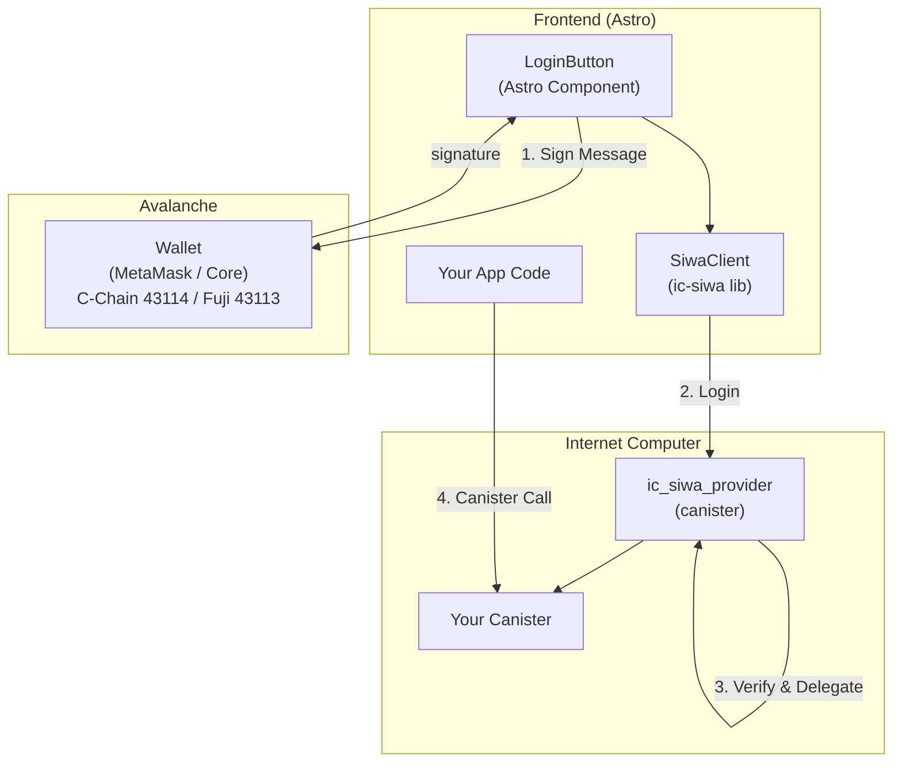

# IC-SIWA

[](https://github.com/irken-empire/ic-siwa/actions/workflows/ci.yaml)
[](https://github.com/irken-empire/ic-siwa/actions/workflows/sec-codeql.yaml)
[](https://github.com/irken-empire/ic-siwa/actions/workflows/sec-trivy.yaml)

_Sign in with Avalanche_ for the Internet Computer.

Build _cross-chain_ Avalanche apps on ICP.

_Try out the [demo](https://siwa-testnet.irkenempire.tech/) on Fuji today!_

## Overview

IC-SIWA enables Avalanche wallet authentication for Internet Computer applications. Users sign in with their Avalanche wallet (C-Chain) and receive an ICP principal for interacting with canisters.

**Key Features:**

- Avalanche C-Chain wallet authentication
- EIP-4361 (SIWE) compatible message format
- Delegated identity for IC canister calls
- Session management with auto-refresh
- **Multi-tenant "SIWA as a Service"** - multiple apps can share one provider
- Multi-domain whitelist support
- TypeScript library with Astro components

## Setup

### Installation

```bash
# TypeScript/Astro projects
bun add ic-siwa

# Or npm
npm install ic-siwa
```

### Basic Usage

```typescript
import {SiwaClient} from "ic-siwa";

const client = new SiwaClient({
  canisterId: "xxxxx-xxxxx-xxxxx-xxxxx-xxx",
});

// Login with any EVM wallet (MetaMask, Core, etc.)
const address = "0x1234...";
const prepared = await client.prepareLogin(address);
const signature = await wallet.signMessage(prepared.message);
const result = await client.login(signature, address);

console.log("ICP Principal:", result.principal.toText());
```

### Multi-Tenant Usage (SIWA as a Service)

IC-SIWA supports multi-tenant scenarios where multiple applications share a single provider canister. Each app can specify its own domain/URI for the wallet signing prompt:

```typescript
import {SiwaClient} from "ic-siwa";

const client = new SiwaClient({
  canisterId: "xxxxx-xxxxx-xxxxx-xxxxx-xxx", // Shared SIWA provider
});

// Each app specifies its own domain
const prepared = await client.prepareLoginWithOptions({
  address: "0x1234...",
  domain: "game.example.com", // Your app's domain (must be whitelisted)
  uri: "https://game.example.com", // Your app's URI
});

const signature = await wallet.signMessage(prepared.message);
const result = await client.login(signature, address);
```

Or use the convenience method with a wallet client:

```typescript
// With viem wallet client
const result = await client.loginWithWallet(walletClient, {
  domain: "game.example.com",
  uri: "https://game.example.com",
});
```

The domain must be in the provider's `allowed_domains` whitelist (configured at canister init).

### Astro Component

```astro
---
import LoginButton from 'ic-siwa/astro';
---

<LoginButton
  canisterId="xxxxx-xxxxx-xxxxx-xxxxx-xxx"
  label="Connect Wallet"
  variant="primary"
/>

<script>
  document.addEventListener('siwa:login-success', (e) => {
    console.log('Logged in:', e.detail.principal);
  });
</script>
```

## Architecture



## Authentication Flow

1. **Prepare Login** - Frontend requests a SIWA message from the canister
2. **Sign Message** - User signs the EIP-4361 message with their Avalanche wallet
3. **Verify & Login** - Canister verifies signature and creates delegation identity
4. **Authenticated** - User receives ICP principal for authenticated canister calls

## Project Structure

```mermaid
block-beta
  columns 1
  block:root["ic-siwa/"]
    block:canisters["canisters/"]
      A["ic_siwa_provider/  — Main authentication canister (Rust)"]
      B["test_canister_rs/  — Rust test canister"]
      C["test_canister_ts/  — TypeScript/Astro test frontend"]
    end
    block:libs["libs/"]
      D["ic_siwa/           — Rust library for canister integration"]
      E["ic_siwa_ts/        — TypeScript library (npm: ic-siwa)"]
    end
    block:scripts["scripts/"]
      F["ic-siwa.sh         — Development CLI tool"]
    end
    block:config["config/"]
      G["development.yaml  — Local development config"]
      H["testnet.yaml      — Avalanche Fuji + IC config"]
      I["mainnet.yaml      — Production config"]
    end
    J["docs/               — Documentation and specs"]
  end
```

## TypeScript Library

### SiwaClient

```typescript
import {SiwaClient, SiwaError, SiwaErrorCode} from "ic-siwa";

const client = new SiwaClient({
  canisterId: "xxxxx-xxxxx-xxxxx-xxxxx-xxx",
  host: "https://ic0.app", // Optional, default: https://ic0.app
  autoRefresh: true, // Optional, auto-refresh delegation
});

// Check authentication
if (await client.isAuthenticated()) {
  const principal = await client.getPrincipal();
  const address = await client.getAddress();
}

// Make authenticated canister calls
const agent = await client.getAgent();
const actor = await client.createActor(canisterId, idlFactory);

// Logout
await client.logout();
```

### Astro LoginButton

| Prop          | Type                                  | Default                  | Description                  |
| ------------- | ------------------------------------- | ------------------------ | ---------------------------- |
| `canisterId`  | `string`                              | required                 | IC-SIWA Provider canister ID |
| `host`        | `string`                              | `https://ic0.app`        | IC host URL                  |
| `label`       | `string`                              | `Sign in with Avalanche` | Button text                  |
| `size`        | `xs\|sm\|md\|lg\|xl`                  | `md`                     | Button size (DaisyUI)        |
| `variant`     | `primary\|secondary\|accent\|neutral` | `primary`                | Color                        |
| `style`       | `solid\|outline\|soft\|ghost`         | `solid`                  | Button style                 |
| `showAddress` | `boolean`                             | `true`                   | Show address when logged in  |

**Events:**

- `siwa:login-start` - Login process started
- `siwa:login-success` - Success with `{ principal, address }`
- `siwa:login-error` - Error with `{ error }`
- `siwa:logout` - User logged out

### Error Handling

```typescript
try {
  await client.login(signature, address);
} catch (error) {
  if (error instanceof SiwaError) {
    switch (error.code) {
      case SiwaErrorCode.InvalidSignature:
        // Handle invalid signature
        break;
      case SiwaErrorCode.MessageExpired:
        // Handle expired message
        break;
      case SiwaErrorCode.CanisterError:
        // Handle canister error
        break;
    }
  }
}
```

## Rust Library

### In Your Canister

```rust
use ic_siwa::{SiwaMessage, Settings, validate_address, derive_principal};

// Create settings
let settings = Settings::new("example.com", "https://example.com", "your-salt")
    .with_chain_id(43114)  // Avalanche Mainnet
    .with_session_expiration(30 * 60 * 1_000_000_000); // 30 minutes

// Validate Avalanche address
validate_address("0x1234...")?;

// Derive ICP principal from address
let principal = derive_principal("0x1234...", "your-salt")?;
```

### Domain Validation

```rust
use ic_siwa::types::DomainValidator;

let validator = DomainValidator::new(&[
    "example.com".to_string(),
    "*.example.com".to_string(),  // Wildcard support
]);

if validator.is_allowed("app.example.com") {
    // Domain is allowed
}
```

## Canister API

### Candid Interface

```candid
service : (InitArgs) -> {
    // Authentication
    siwa_prepare_login : (address : text) -> (PrepareLoginResponse);
    siwa_prepare_login_with_options : (PrepareLoginRequest) -> (PrepareLoginResponse);  // Multi-tenant
    siwa_login : (signature : text, address : text, session_key : blob) -> (LoginResponse);
    siwa_get_delegation : (address : text, session_key : blob, expiration : nat64) -> (GetDelegationResponse) query;

    // Lookups
    get_principal : (address : text) -> (PrincipalResponse) query;
    get_address : (principal : principal) -> (AddressResponse) query;
    get_caller_address : () -> (AddressResponse) query;
}

// Multi-tenant request type
type PrepareLoginRequest = record {
    address : text;           // Avalanche address (0x-prefixed)
    domain : opt text;        // Optional domain (must be in allowed_domains)
    uri : opt text;           // Optional URI
};
```

### Initialization

```candid
type InitArgs = record {
    domain : text;                        // Default domain (fallback when not specified per-request)
    uri : text;                           // Default URI (fallback when not specified per-request)
    salt : text;                          // Secret salt for principal derivation
    chain_id : nat64;                     // 43114 (mainnet) or 43113 (fuji)
    session_expiration_time : nat64;      // Nanoseconds (e.g., 30 minutes)
    allowed_domains : opt vec text;       // Whitelist for multi-tenant domains
    allowed_canisters : opt vec principal; // Canister whitelist
    delegation_targets : opt vec principal; // Canisters delegations are valid for
};
```

For multi-tenant setups, `allowed_domains` should include all app domains that can use this provider:

```yaml
# config/mainnet.yaml
security:
  allowed_domains:
    - "myapp.com"
    - "*.myapp.com"
    - "partner-game.io"
    - "*.partner-game.io"
```

## Development

### Prerequisites

- [devenv](https://devenv.sh/) with Nix
- Rust with `wasm32-unknown-unknown` target
- Bun or npm

### Quick Start

```bash
# Enter development shell
devenv shell

# Full development loop (format, lint, build, test, deploy)
ic-siwa loop

# Or individual commands
ic-siwa build          # Build all canisters
ic-siwa test           # Run tests
ic-siwa deploy         # Deploy to local replica
ic-siwa fmt            # Format code
ic-siwa lint           # Run linters
```

### CLI Commands

| Command           | Description                                    |
| ----------------- | ---------------------------------------------- |
| `ic-siwa build`   | Build Rust canisters                           |
| `ic-siwa candid`  | Generate TypeScript from Candid                |
| `ic-siwa test`    | Run unit tests                                 |
| `ic-siwa deploy`  | Deploy canisters (use `--network` flag)        |
| `ic-siwa upgrade` | Upgrade deployed canisters                     |
| `ic-siwa cleanup` | Clean build artifacts (`--prune` for canister) |
| `ic-siwa start`   | Start local IC replica                         |
| `ic-siwa stop`    | Stop local IC replica                          |
| `ic-siwa update`  | Update all dependencies                        |
| `ic-siwa version` | Show/bump version (`--bump`, `--check`, etc.)  |
| `ic-siwa loop`    | Full dev loop: fmt, lint, build, test, deploy  |

### Networks

```bash
ic-siwa deploy --network dfx    # Local DFX replica (default)
ic-siwa deploy --network juno   # Local Juno/PocketIC
ic-siwa deploy --network ic     # IC mainnet
```

### Local Development

```bash
# Enter development shell
devenv shell

# Start local IC replica
ic-siwa start

# Deploy canisters
ic-siwa deploy

# Get canister URLs
ic-siwa urls
```

### Production Deployment

```bash
# Deploy to IC mainnet
ic-siwa deploy --network ic
```

## Configuration

### Environment Variables

Configuration is loaded from YAML files in `config/`:

| Variable        | Description                     | Example               |
| --------------- | ------------------------------- | --------------------- |
| `SIWA_DOMAIN`   | Primary domain                  | `example.com`         |
| `SIWA_URI`      | Application URI                 | `https://example.com` |
| `SIWA_SALT`     | Secret for principal derivation | (from secrets)        |
| `SIWA_CHAIN_ID` | Avalanche chain ID              | `43114`               |

### Secrets Management

Secrets are defined in `secretspec.toml` and loaded via environment:

```toml
[secrets]
SIWA_SALT = { env = "SIWA_SALT" }
```

## Security

- **Domain Whitelist**: Only configured domains can initiate login
- **Canister Whitelist**: Inter-canister calls restricted to whitelist
- **Session Expiration**: Delegations expire after configured time
- **Nonce Protection**: Replay attacks prevented via nonces
- **EIP-55 Checksums**: Address validation includes checksum verification

## Supported Chains

| Chain             | Chain ID | Network |
| ----------------- | -------- | ------- |
| Avalanche C-Chain | 43114    | Mainnet |
| Avalanche Fuji    | 43113    | Testnet |

## Requirements

- Avalanche-compatible wallet (Core, MetaMask, etc.)
- DaisyUI + Tailwind CSS (for Astro component)
- IC replica or mainnet access

## Contributing

```bash
# Enter dev shell
devenv shell

# Make changes, then run full loop
ic-siwa loop

# Update dependencies
ic-siwa update

# Bump version (uses conventional commits based on tags)
ic-siwa version --bump
```

## License

Unlicense - See [LICENSE](LICENSE) for details.

## Acknowledgments

See [SHOULDERS.md](SHOULDERS.md) for credits to the projects that made IC-SIWA possible.
