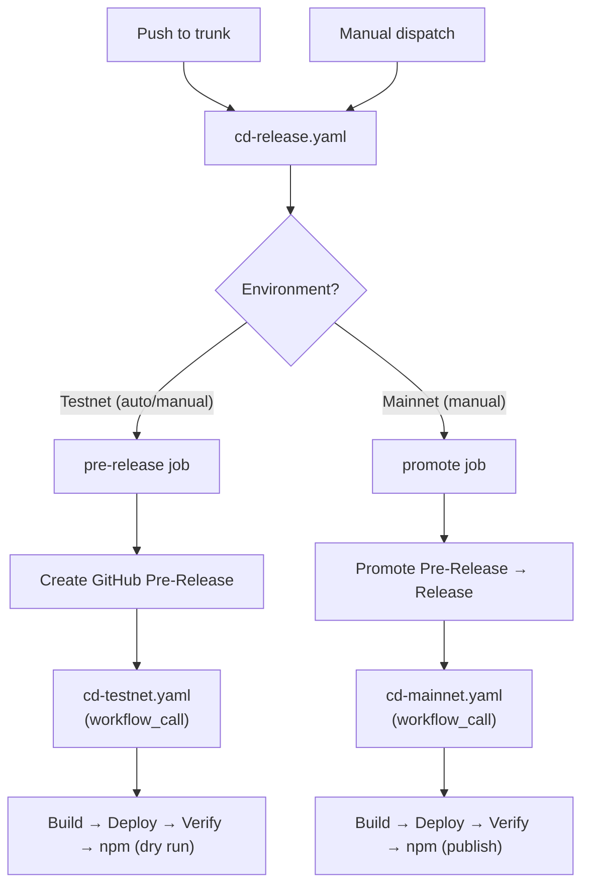
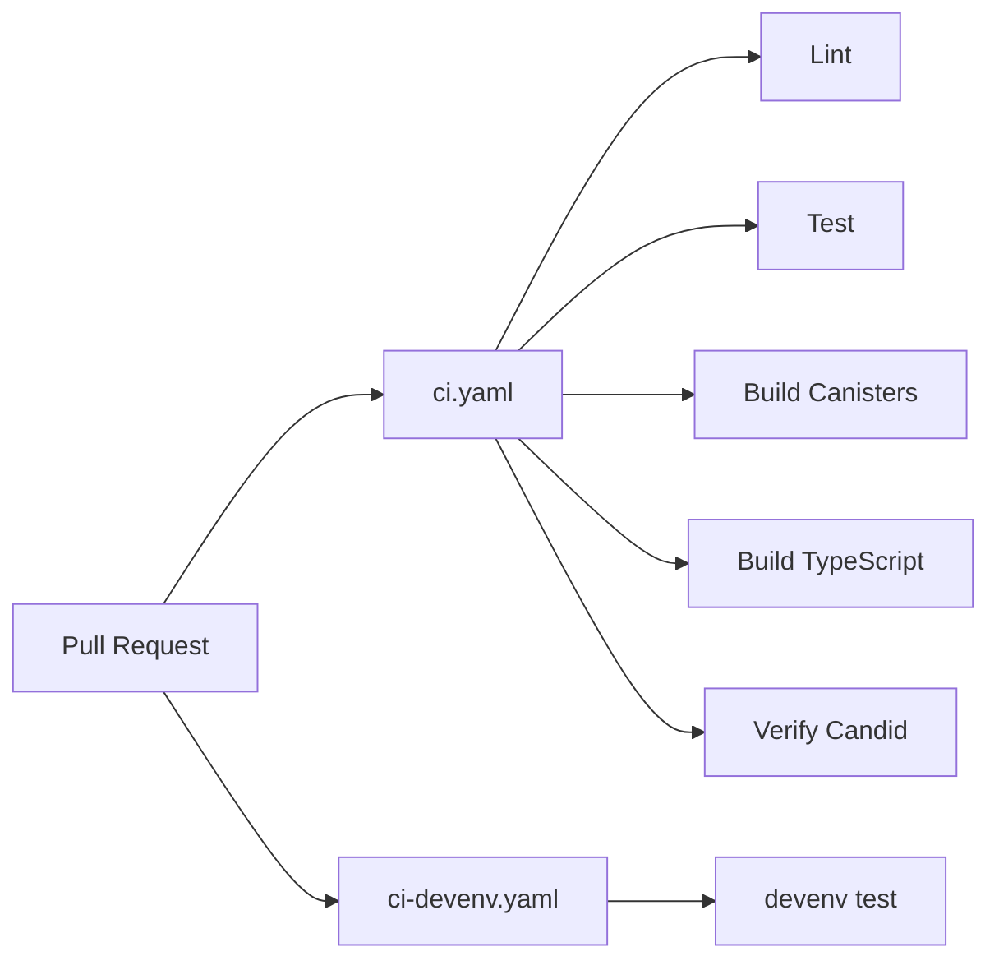

# CI/CD Architecture

## Release Flow

## CI Pipeline

## `workflow_call` Design

Deploy workflows (`cd-testnet.yaml`, `cd-mainnet.yaml`) accept both `workflow_call` and `workflow_dispatch` triggers:

- **`workflow_call`** — called by `cd-release.yaml` after creating/promoting a release.
  Version and `accept_breaking_changes` are passed as inputs. Uses `secrets: inherit`.
  Lint/test jobs are **skipped** (already run by CI on the PR).
- **`workflow_dispatch`** — manual fallback. Lint/test jobs **run** since there's no prior CI guarantee.

This replaces the previous event-based chaining (`release: types: [prereleased/released]`), which required a Personal Access Token because `GITHUB_TOKEN` events don't trigger further workflows.

## Workflow Inventory

| Workflow                   | Prefix | Trigger                     | Purpose                                          |
| -------------------------- | ------ | --------------------------- | ------------------------------------------------ |
| `cd-release.yaml`          | cd     | push to trunk, dispatch     | Create pre-release or promote to release         |
| `cd-testnet.yaml`          | cd     | workflow_call, dispatch     | Build, deploy, verify on IC Testnet              |
| `cd-mainnet.yaml`          | cd     | workflow_call, dispatch     | Build, deploy, verify, publish npm on IC Mainnet |
| `ci.yaml`                  | ci     | pull_request                | Lint, test, build canisters, verify Candid       |
| `ci-devenv.yaml`           | ci     | pull_request                | Test devenv shell                                |
| `chore-devenv-update.yaml` | chore  | schedule (weekly), dispatch | Update devenv.lock, create PR                    |

## Composite Actions

| Action               | Purpose                                                |
| -------------------- | ------------------------------------------------------ |
| `setup-devenv`       | Nix + Cachix + devenv + secretspec (checkout separate) |
| `report-status`      | Report CI status to GitHub commit status API           |
| `read-config`        | Read environment-specific YAML config                  |
| `build-canister`     | Build Rust WASM or Assets canister                     |
| `deploy-canister`    | Deploy canister to IC mainnet                          |
| `verify-canister`    | Run smoke tests against deployed canister              |
| `setup-canister-ids` | Copy env-specific `canister_ids.json`                  |
| `build-npm`          | Build ic-siwa TypeScript library                       |
| `publish-npm`        | Publish to npm (supports dry run)                      |
| `register-domain`    | Register custom domain with IC boundary nodes          |

## Naming Conventions

| Element           | Convention                                 | Example                    |
| ----------------- | ------------------------------------------ | -------------------------- |
| Workflow filename | `{ci\|cd\|chore}-{component}[-{env}].yaml` | `chore-devenv-update.yaml` |
| Workflow `name:`  | Title Case                                 | `Deploy (Testnet)`         |
| Job ID            | `kebab-case`                               | `deploy-provider`          |
| Job `name:`       | Title Case                                 | `Deploy Provider`          |
| Step ID           | `snake_case`                               | `setup_devenv`             |
| Step `name:`      | Title Case Verb-Noun                       | `Setup Devenv`             |
| Action inputs     | `kebab-case`                               | `github-token`             |
| File extension    | `.yaml`                                    | —                          |
