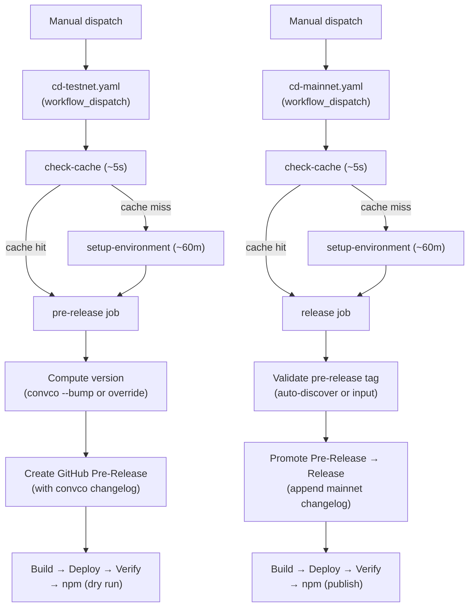
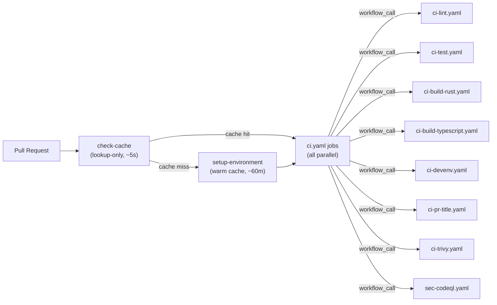

# CI/CD Architecture

## Release Flow

## Developer Workflow

```mermaid
graph LR
    A["Create branch"] --> B["Open PR"]
    B --> C["CI runs\n(lint, test, build, security)"]
    C --> D["PR approved"]
    D --> E["Merge queue"]
    E --> F["Merged to trunk"]
    F --> G["Merge more PRs\n(accumulate changes)"]
    G --> H["Run cd-testnet.yaml\n(manual dispatch)"]
    H --> I["Pre-release created\n+ Testnet deployed"]
    I --> J["UAT / QA"]
    J --> K["Run cd-mainnet.yaml\n(manual dispatch)"]
    K --> L["Promoted + deployed"]
```

## Manually Runnable Workflows

Only these workflows can be triggered manually via `workflow_dispatch`:

| Workflow                   | Purpose                                   |
| -------------------------- | ----------------------------------------- |
| `cd-testnet.yaml`          | Create pre-release + deploy to Testnet    |
| `cd-mainnet.yaml`          | Promote pre-release and deploy to Mainnet |
| `chore-devenv-update.yaml` | Update devenv.lock, create PR             |

All other workflows are triggered automatically by events (PR, push, merge_group, schedule, workflow_call).

## Testnet Release

When running `cd-testnet.yaml`:

- **With `version`**: Uses the specified version (e.g. `v0.3.0` or `0.3.0`)
- **Without `version`**: Auto-bumps from conventional commits via `convco version --bump`
  - Multiple `feat`/`fix` PRs merged since the last tag all appear in the single release changelog
  - If no bump-worthy commits exist, the release is skipped
- Creates a GitHub **pre-release** tagged `vX.Y.Z`
- Runs a `ship it` confirmation guard before proceeding

## Mainnet Promotion

When running `cd-mainnet.yaml`:

- **With `release_tag`**: Promotes that specific pre-release
- **Without `release_tag`**: Auto-discovers the latest pre-release and promotes it
- **If latest release is already promoted**: Errors with a helpful message
- Promotes the GitHub pre-release to a full **release**
- Appends mainnet deployment info to the release notes
- Runs a `ship it` confirmation guard before proceeding

The GitHub `Mainnet` environment requires manual approval before the deploy job runs.

## CI Pipeline

### The "Gatekeeper" Strategy

We use a cache-aware orchestration pipeline that avoids redundant warm-up work.

1. `check-cache` runs a **lookup-only** probe (`actions/cache` with `lookup-only: true`) against
   the Nix store key `${{ runner.os }}-nix-${{ hashFiles('devenv.lock', 'devenv.nix') }}`.
   This takes ~5 seconds and does not download anything.
2. If the cache **exists** (common case Mon–Fri): `setup-environment` is skipped and all CI
   jobs fire immediately in parallel.
3. If the cache **is missing** (new `devenv.lock` hash, or after the weekly chore): `setup-environment`
   runs synchronously (~60 min) to warm the cache, then all CI jobs fan out.

The weekly `chore-devenv-update.yaml` runs every Sunday night and warms the cache for the coming
week, so developer PRs consistently hit the fast (~10 min) path.

### Cachix Push Optimisation

Only the `setup-environment` job (the Gatekeeper warm-up) pushes to Cachix.
All other jobs — CI sub-workflows and CD deploy jobs — set `skip-push: "true"` on the
`setup-devenv` action so they only pull/substitute from the cache, never push.

**Cache Key (`devenv.lock` + `devenv.nix` Hash)**
The `setup-devenv` action uses `hashFiles('devenv.lock', 'devenv.nix')` for the primary cache key,
achieving a **0-second upload penalty** on subsequent restores.

## Workflow Inventory

| Workflow                   | Prefix | Trigger                     | Purpose                                           |
| -------------------------- | ------ | --------------------------- | ------------------------------------------------- |
| `cd-testnet.yaml`          | cd     | dispatch only               | Create pre-release + deploy to IC Testnet         |
| `cd-mainnet.yaml`          | cd     | dispatch only               | Promote release + deploy + publish npm on Mainnet |
| `ci.yaml`                  | ci     | pull_request, merge_group   | Gatekeeper entrypoint for CI                      |
| `ci-lint.yaml`             | ci     | workflow_call only          | Lint the project                                  |
| `ci-test.yaml`             | ci     | workflow_call only          | Test the project                                  |
| `ci-build-rust.yaml`       | ci     | workflow_call only          | Build all IC canisters + verify Candid            |
| `ci-build-typescript.yaml` | ci     | workflow_call only          | Build npm package                                 |
| `ci-devenv.yaml`           | ci     | workflow_call only          | Validate developer environment setup              |
| `chore-devenv-update.yaml` | chore  | schedule (weekly), dispatch | Update devenv.lock, create PR                     |
| `ci-pr-title.yaml`         | ci     | workflow_call only          | Validate conventional commit PR titles            |
| `sec-codeql.yaml`          | sec    | workflow_call only          | CodeQL security analysis                          |
| `ci-trivy.yaml`            | ci     | workflow_call only          | Trivy vulnerability scanning                      |

## Composite Actions

| Action               | Purpose                                                |
| -------------------- | ------------------------------------------------------ |
| `setup-devenv`       | Nix + Cachix + devenv + secretspec (checkout separate) |
| `report-status`      | Report CI status to GitHub commit status API           |
| `read-config`        | Read environment-specific YAML config                  |
| `build-canister`     | Build Rust WASM or Assets canister                     |
| `deploy-canister`    | Deploy canister to IC mainnet                          |
| `verify-canister`    | Run smoke tests against deployed canister              |
| `setup-canister-ids` | Copy env-specific `canister_ids.json`                  |
| `build-npm`          | Build ic-siwa TypeScript library                       |
| `publish-npm`        | Publish to npm (supports dry run)                      |
| `register-domain`    | Register custom domain with IC boundary nodes          |

## Naming Conventions

| Element           | Convention                                 | Example                    |
| ----------------- | ------------------------------------------ | -------------------------- |
| Workflow filename | `{ci\|cd\|chore}-{component}[-{env}].yaml` | `chore-devenv-update.yaml` |
| Workflow `name:`  | Title Case                                 | `Release (Testnet)`        |
| Job ID            | `kebab-case`                               | `deploy-provider`          |
| Job `name:`       | Title Case                                 | `Deploy Provider`          |
| Step ID           | `snake_case`                               | `setup_devenv`             |
| Step `name:`      | Title Case Verb-Noun                       | `Setup Devenv`             |
| Action inputs     | `kebab-case`                               | `github-token`             |
| File extension    | `.yaml`                                    | —                          |
