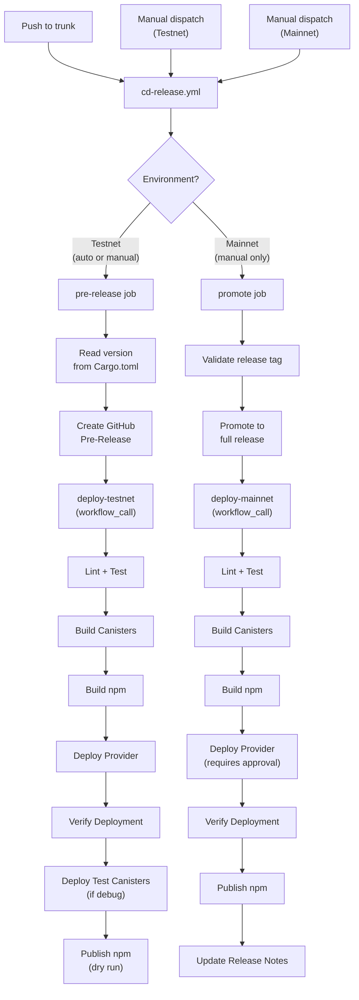
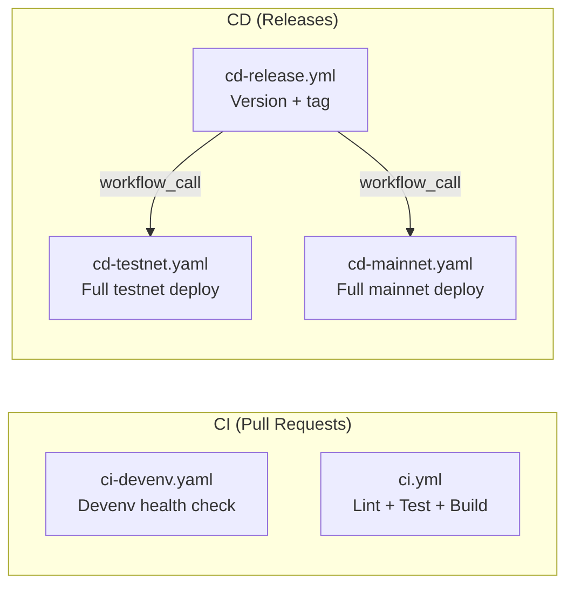

# CI/CD Pipeline

## Overview

The ic-siwa project uses GitHub Actions for CI/CD with a release-driven deployment model.
Workflows are chained using `workflow_call` for reliable, explicit orchestration.

## Release Flow

## CI Pipelines

## Workflows

| Workflow          | Trigger                      | Description                                |
| ----------------- | ---------------------------- | ------------------------------------------ |
| `ci-devenv.yaml`  | PR, push                     | Validates devenv builds correctly          |
| `ci.yml`          | PR, push                     | Lint, test, and build canisters + npm      |
| `cd-release.yml`  | Push to trunk, manual        | Creates pre-release or promotes to release |
| `cd-testnet.yaml` | Called by cd-release, manual | Full testnet deployment pipeline           |
| `cd-mainnet.yaml` | Called by cd-release, manual | Full mainnet deployment pipeline           |

## Environments

| Environment | Purpose                        | Secrets                                           |
| ----------- | ------------------------------ | ------------------------------------------------- |
| **Testnet** | Staging deployments            | `DFX_IDENTITY_PEM`, `IC_SIWA_SALT`, Cachix tokens |
| **Mainnet** | Production (requires approval) | `DFX_IDENTITY_PEM`, `IC_SIWA_SALT`, Cachix tokens |

## Design Decisions

### workflow_call over event chaining

Deploy workflows are called directly via `workflow_call` rather than triggered by `release` events
(`prereleased`/`released`). This avoids [GitHub's `GITHUB_TOKEN` limitation](https://docs.github.com/en/actions/writing-workflows/choosing-when-your-workflow-runs/triggering-a-workflow#triggering-a-workflow-from-a-workflow)
where events created by `GITHUB_TOKEN` do not trigger other workflows.

Deploy workflows also support `workflow_dispatch` for manual re-runs independent of the release flow.

### Canister build matrix

Canisters are built in parallel using a matrix strategy. Artifacts are uploaded and shared
between the build and deploy jobs to avoid rebuilding.
