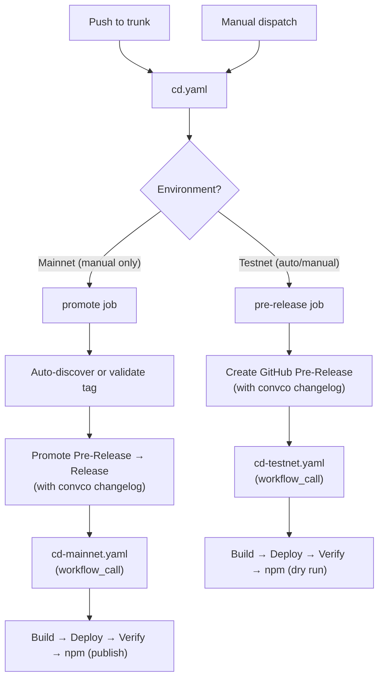
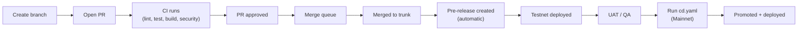
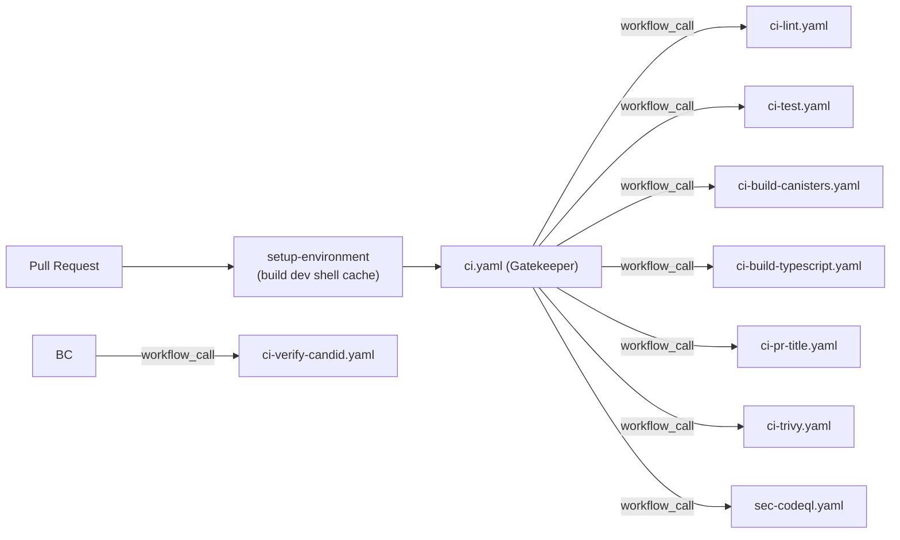

# CI/CD Architecture

## Release Flow

## Developer Workflow

## Manually Runnable Workflows

Only these workflows can be triggered manually via `workflow_dispatch`:

| Workflow                   | Purpose                                           |
| -------------------------- | ------------------------------------------------- |
| `cd.yaml`                  | Create pre-release (Testnet) or promote (Mainnet) |
| `chore-devenv-update.yaml` | Update devenv.lock, create PR                     |

All other workflows are triggered automatically by events (PR, push, merge_group, schedule, workflow_call).

## Mainnet Promotion

When running `cd.yaml` with `Environment: Mainnet`:

- **With `release_tag`**: Promotes that specific pre-release
- **Without `release_tag`**: Auto-discovers the latest pre-release and promotes it
- **If latest release is already promoted**: Errors with a helpful message

The GitHub `Mainnet` environment requires manual approval before the promote job runs.

## CI Pipeline

### The "Gatekeeper" Strategy

We use a strictly-parallel orchestration pipeline pattern.

1. `ci.yaml` and `cd.yaml` act as absolute entry points (Gatekeepers).
2. The gatekeeper triggers `setup-devenv` synchronously, populating the GitHub L2 cache.
3. Once populated, the Gatekeeper fires off all subsequent workflows (`ci-lint.yaml`, `ci-test.yaml`, `cd-testnet.yaml` etc.) in strictly segregated runners using `workflow_call`.

**30-Day Caching (`devenv.lock` Hash)**
The `setup-devenv` action uses `hashFiles('devenv.lock', 'devenv.nix')` for the primary cache key.
This explicitly maps the cache to that exact deterministic hash, achieving a **0-second upload penalty**
at the end of every workflow, and the cache is kept alive for 30 days.

## Workflow Inventory

| Workflow                   | Prefix | Trigger                     | Purpose                                          |
| -------------------------- | ------ | --------------------------- | ------------------------------------------------ |
| `cd.yaml`                  | cd     | push to trunk, dispatch     | Create pre-release or promote to release         |
| `cd-testnet.yaml`          | cd     | workflow_call only          | Build, deploy, verify on IC Testnet              |
| `cd-mainnet.yaml`          | cd     | workflow_call only          | Build, deploy, verify, publish npm on IC Mainnet |
| `ci.yaml`                  | ci     | pull_request, merge_group   | Gatekeeper entrypoint for CI                     |
| `ci-lint.yaml`             | ci     | workflow_call only          | Lint the project                                 |
| `ci-test.yaml`             | ci     | workflow_call only          | Test the project                                 |
| `ci-build-canisters.yaml`  | ci     | workflow_call only          | Build all IC canisters                           |
| `ci-build-typescript.yaml` | ci     | workflow_call only          | Build npm package                                |
| `ci-verify-candid.yaml`    | ci     | workflow_call only          | Verify Candid interfaces                         |
| `chore-devenv-update.yaml` | chore  | schedule (weekly), dispatch | Update devenv.lock, create PR                    |
| `ci-pr-title.yaml`         | ci     | workflow_call only          | Validate conventional commit PR titles           |
| `sec-codeql.yaml`          | sec    | workflow_call only          | CodeQL security analysis                         |
| `ci-trivy.yaml`            | ci     | workflow_call only          | Trivy vulnerability scanning                     |

## Composite Actions

| Action               | Purpose                                                |
| -------------------- | ------------------------------------------------------ |
| `setup-devenv`       | Nix + Cachix + devenv + secretspec (checkout separate) |
| `report-status`      | Report CI status to GitHub commit status API           |
| `read-config`        | Read environment-specific YAML config                  |
| `build-canister`     | Build Rust WASM or Assets canister                     |
| `deploy-canister`    | Deploy canister to IC mainnet                          |
| `verify-canister`    | Run smoke tests against deployed canister              |
| `setup-canister-ids` | Copy env-specific `canister_ids.json`                  |
| `build-npm`          | Build ic-siwa TypeScript library                       |
| `publish-npm`        | Publish to npm (supports dry run)                      |
| `register-domain`    | Register custom domain with IC boundary nodes          |

## Naming Conventions

| Element           | Convention                                 | Example                    |
| ----------------- | ------------------------------------------ | -------------------------- |
| Workflow filename | `{ci\|cd\|chore}-{component}[-{env}].yaml` | `chore-devenv-update.yaml` |
| Workflow `name:`  | Title Case                                 | `Deploy (Testnet)`         |
| Job ID            | `kebab-case`                               | `deploy-provider`          |
| Job `name:`       | Title Case                                 | `Deploy Provider`          |
| Step ID           | `snake_case`                               | `setup_devenv`             |
| Step `name:`      | Title Case Verb-Noun                       | `Setup Devenv`             |
| Action inputs     | `kebab-case`                               | `github-token`             |
| File extension    | `.yaml`                                    | —                          |
